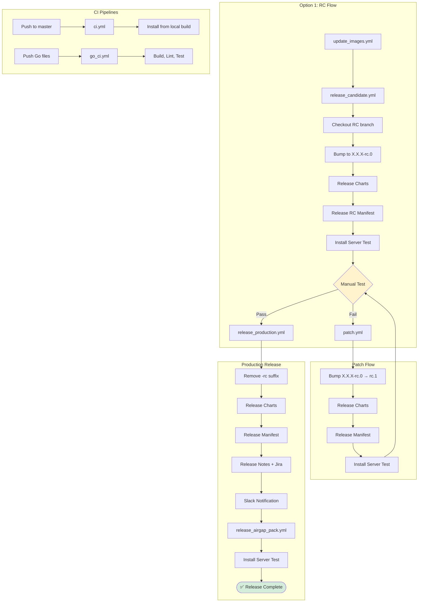

# GitHub Actions Workflows & Actions Diagram

## Overview

This document describes all GitHub Actions workflows and reusable actions in the `.github` folder.

## Workflows Overview

### Main Release Workflows
- **`release_candidate.yml`** - Creates RC branch, bumps version, releases charts and RC manifest
- **`release_production.yml`** - Removes RC suffix, releases charts, releases production manifest, generates release notes, notifies Slack
- **`patch.yml`** - Manual patch workflow: Bumps RC version, releases charts and manifest

### Supporting Workflows
- **`_install_server.yml`** - Reusable workflow to install Tensorleap server using leap-cli
- **`release_airgap_pack.yml`** - Builds and uploads airgap pack to S3 (callable + manual)
- **`update_images.yml`** - Waits for web-ui build, updates image tags in charts

### CI Workflows
- **`ci.yml`** - CI on push to master: Installs server from local Go build
- **`go_ci.yml`** - CI for Go code (format check, build, lint, test)

### Reusable Actions
- **`actions/release-chart/action.yml`** - Releases Helm charts using chart-releaser
- **`actions/release-manifest/action.yml`** - Generates and releases installation manifest

---

## Release Flow Overview

```
┌─────────────────────────────────────────────────────────────────────────────┐
│                         RELEASE FLOW OPTIONS                                │
├─────────────────────────────────────────────────────────────────────────────┤
│                                                                             │
│  Option 1: Full RC Flow                                                     │
│  ─────────────────────                                                      │
│  update_images.yml → release_candidate.yml → (test) → release_production   │
│                                                                             │
│  Option 2: Direct Production (from RC branch)                               │
│  ────────────────────────────────────────────                               │
│  release_production.yml (from branch X.X.X with -rc suffix)                 │
│                                                                             │
│  Option 3: Direct Production (from master)                                  │
│  ────────────────────────────────────────────                               │
│  release_production.yml (from master, no -rc suffix to remove)              │
│                                                                             │
│  Option 4: Patch Flow (after failed RC)                                     │
│  ──────────────────────────────────────                                     │
│  patch.yml → (test) → release_production.yml                                │
│                                                                             │
└─────────────────────────────────────────────────────────────────────────────┘
```

---

## Workflow: `release_candidate.yml`

**Purpose:** Create a release candidate with versioned charts and manifest.

**Triggers:**
- `workflow_call` (called by other workflows)
- `workflow_dispatch` (manual)

**Inputs:**
- `custom_tag_prefix` (optional): Custom tag prefix for manifest

**Flow:**

```
┌───────────────────────────────────────────────────────────────┐
│                  📦 release_candidate.yml                     │
│                  (Manual or Called)                           │
└──────────────────────┬────────────────────────────────────────┘
                       │
                       ▼
┌─────────────────────────────────────────────────────────────────┐
│ Job: release                                                    │
│   ├─ Checkout repository                                        │
│   ├─ Configure Git identity                                     │
│   ├─ Checkout RC branch (make checkout-rc-branch)               │
│   │   └─ From master: creates branch X.X.X with version X.X.X-rc.0│
│   │   └─ From branch: bumps RC version (X.X.X-rc.0 → X.X.X-rc.1)│
│   ├─ Set up Helm                                                │
│   ├─ Extract image names (make build-helm, make update-images)  │
│   ├─ Get chart version                                          │
│   ├─ Commit changes                                             │
│   ├─ Release Charts (release-chart action)                      │
│   └─ Release RC Manifest (release-manifest action)              │
└──────────────────────┬──────────────────────────────────────────┘
                       │
                       ▼
┌─────────────────────────────────────────────────────────────────┐
│ Job: install-server                                             │
│   └─ Uses _install_server.yml with tag from release job         │
└─────────────────────────────────────────────────────────────────┘
```

**Outputs:**
- RC branch name (e.g., `1.5.9`)
- Chart version (e.g., `1.5.9-rc.0`)
- Manifest release with tag (e.g., `1.5.9-rc.0`)

---

## Workflow: `release_production.yml`

**Purpose:** Release production version of charts and manifest.

**Triggers:**
- `workflow_dispatch` (manual) - Run from RC branch OR master

**Flow:**

```
┌───────────────────────────────────────────────────────────────┐
│                  🚀 release_production.yml                    │
│                  (Manual Trigger)                             │
│                  Run from: RC branch (X.X.X) or master        │
└──────────────────────┬────────────────────────────────────────┘
                       │
                       ▼
┌─────────────────────────────────────────────────────────────────┐
│ Job: release-production                                         │
│   ├─ Checkout repository                                        │
│   ├─ Configure Git identity                                     │
│   ├─ Remove -rc.x suffix (make remove-rc-suffix)                │
│   │   └─ From RC: X.X.X-rc.0 → X.X.X                           │
│   │   └─ From master: no change (no -rc suffix)                │
│   ├─ Get chart version                                          │
│   ├─ Set up Helm                                                │
│   ├─ Extract image names (make build-helm, make update-images)  │
│   ├─ Commit version changes                                     │
│   ├─ Release Charts (release-chart action)                      │
│   ├─ Release Manifest (release-manifest action)                 │
│   │   └─ Tag: manifest-X.X.X                                   │
│   ├─ Set up Python                                              │
│   ├─ Generate Release Notes & Update Jira fixVersion            │
│   ├─ Commit Release Notes                                       │
│   └─ Notify Slack - Release Complete                            │
└──────────────────────┬──────────────────────────────────────────┘
                       │
                       ▼
┌─────────────────────────────────────────────────────────────────┐
│ Job: release-airgap                                             │
│   └─ Uses release_airgap_pack.yml                               │
│       └─ manifest_name: manifest-X.X.X                          │
└──────────────────────┬──────────────────────────────────────────┘
                       │
                       ▼
┌─────────────────────────────────────────────────────────────────┐
│ Job: install-server                                             │
│   └─ Uses _install_server.yml                                   │
│       └─ tag: manifest-X.X.X                                    │
└─────────────────────────────────────────────────────────────────┘
```

**Outputs:**
- Production manifest release (`manifest-X.X.X`)
- Airgap pack uploaded to S3
- Release notes updated
- Jira fixVersion created/updated
- Slack notification

---

## Workflow: `patch.yml`

**Purpose:** Bump RC version for patching after test failures.

**Triggers:**
- `workflow_dispatch` (manual)

**Inputs:**
- `custom_tag_prefix` (optional): Custom tag prefix for manifest

**Flow:**

```
┌───────────────────────────────────────────────────────────────┐
│                  🔧 patch.yml                                 │
│                  (Manual Trigger)                             │
└──────────────────────┬────────────────────────────────────────┘
                       │
                       ▼
┌─────────────────────────────────────────────────────────────────┐
│ Job: patch                                                      │
│   ├─ Checkout repository                                        │
│   ├─ Configure Git identity                                     │
│   ├─ Checkout RC branch (make checkout-rc-branch)               │
│   │   └─ Bumps version: X.X.X-rc.0 → X.X.X-rc.1                │
│   ├─ Get new version                                            │
│   ├─ Set up Helm                                                │
│   ├─ Extract image names                                        │
│   ├─ Validate images.txt (make validate-images)                 │
│   ├─ Helm Chart Validation (tensorleap)                         │
│   ├─ Helm Chart Validation (tensorleap-infra)                   │
│   ├─ Commit version changes                                     │
│   ├─ Release Charts (release-chart action)                      │
│   └─ Release Manifest (release-manifest action)                 │
└──────────────────────┬──────────────────────────────────────────┘
                       │
                       ▼
┌─────────────────────────────────────────────────────────────────┐
│ Job: install-server                                             │
│   └─ Uses _install_server.yml with new RC tag                   │
└─────────────────────────────────────────────────────────────────┘
```

---

## Workflow: `_install_server.yml`

**Purpose:** Reusable workflow to install Tensorleap server for validation.

**Triggers:**
- `workflow_call` only (reusable)

**Inputs:**
- `tag` (required): Manifest tag to install

**Flow:**

```
┌─────────────────────────────────────────────────────────────────┐
│ Job: install-server (timeout: 30 minutes)                       │
│   ├─ Install leap-cli                                           │
│   │   └─ curl install.sh from leap-cli repo                     │
│   │   └─ Validate success                                       │
│   └─ Install Tensorleap server                                  │
│       └─ leap server install -t <tag>                           │
│       └─ Validate success                                       │
└─────────────────────────────────────────────────────────────────┘
```

**Used by:**
- `release_candidate.yml`
- `release_production.yml`
- `patch.yml`

---

## Workflow: `update_images.yml`

**Purpose:** Update image tags in charts when new images are available.

**Triggers:**
- `workflow_dispatch` (manual)

**Flow:**

```
┌─────────────────────────────────────────────────────────────────┐
│ Job: wait-for-stable-images                                     │
│   └─ Wait for web-ui build (tag-public-ecr-image-as-stable)     │
└──────────────────────┬──────────────────────────────────────────┘
                       │
                       ▼
┌─────────────────────────────────────────────────────────────────┐
│ Job: update-images                                              │
│   ├─ Checkout repository                                        │
│   ├─ Configure Git                                              │
│   ├─ Install js-yaml                                            │
│   ├─ Update charts (GitHub Script)                              │
│   │   ├─ Get latest image tags: engine, node-server, web-ui     │
│   │   ├─ Update values.yaml files                               │
│   │   ├─ Bump chart versions                                    │
│   │   └─ Update *-latest-image files                            │
│   ├─ Extract image names (make build-helm, make update-images)  │
│   └─ Commit changes                                             │
└─────────────────────────────────────────────────────────────────┘
```

---

## Workflow: `release_airgap_pack.yml`

**Purpose:** Build and upload airgap installation package to S3.

**Triggers:**
- `workflow_call` (called by `release_production.yml`)
- `workflow_dispatch` (manual)

**Inputs:**
- `manifest_name` (optional): Name of the manifest

**Flow:**

```
┌─────────────────────────────────────────────────────────────────┐
│ Job: build (runs-on: ubuntu-32-cores)                           │
│   ├─ Checkout repository                                        │
│   ├─ Configure AWS credentials                                  │
│   ├─ Set up Go                                                  │
│   ├─ Check format (make check-fmt)                              │
│   ├─ Get tensorleap chart version                               │
│   ├─ Save manifest version                                      │
│   ├─ Build Airgap Pack (go run . pack)                          │
│   ├─ Upload to S3                                               │
│   │   └─ s3://tensorleap-assets/airgap-versions/tl-<manifest>-linux-amd64.tar.gz│
│   ├─ Checkout to index branch                                   │
│   ├─ Update index (node generate-airgap-versions.js)            │
│   └─ Commit changes                                             │
└─────────────────────────────────────────────────────────────────┘
```

---

## Workflow: `ci.yml`

**Purpose:** CI workflow that installs server from local Go build.

**Triggers:**
- `push` to `master` branch

**Flow:**

```
┌─────────────────────────────────────────────────────────────────┐
│ Job: install-server-local-build (runs-on: ubuntu-16-cores)      │
│   ├─ Checkout                                                   │
│   ├─ Set up Go                                                  │
│   └─ Install Tensorleap Server from local build                 │
│       └─ go run . install --local                               │
└─────────────────────────────────────────────────────────────────┘
```

---

## Workflow: `go_ci.yml`

**Purpose:** CI for Go code quality.

**Triggers:**
- `push` (on changes to: `go.mod`, `go.sum`, `main.go`, `cmd/**`, `pkg/**`)

**Flow:**

```
┌─────────────────────────────────────────────────────────────────┐
│ Job: build                                                      │
│   ├─ Checkout                                                   │
│   ├─ Set up Go                                                  │
│   ├─ Check format (make check-fmt)                              │
│   ├─ Build (go build .)                                         │
│   ├─ Lint (golangci-lint)                                       │
│   └─ Test (make test)                                           │
└─────────────────────────────────────────────────────────────────┘
```

---

## Reusable Actions

### 1. `actions/release-chart/action.yml`

**Purpose:** Release Helm charts using chart-releaser-action.

**Inputs:**
- `github_token` (required): GitHub token for authentication
- `branch` (required): Branch to checkout and release from

**Steps:**
1. Checkout branch with `ref: ${{ inputs.branch }}` (gets latest commits)
2. Configure Git
3. Run chart-releaser-action
   - Packages charts from `charts/` directory
   - Creates GitHub releases with `.tgz` packages
   - Updates ONLY `index.yaml` on `index` branch

**Used by:**
- `release_candidate.yml`
- `release_production.yml`
- `patch.yml`

---

### 2. `actions/release-manifest/action.yml`

**Purpose:** Generate and release installation manifest.

**Inputs:**
- `github_token` (required): GitHub token for authentication
- `custom_tag_prefix` (optional): Custom tag prefix (default: empty)
- `manifest_output` (optional): Output filename (default: `manifest.yaml`)
- `branch` (optional): Branch to checkout

**Steps:**
1. Checkout repository
2. Set up Go
3. Get tensorleap chart version
4. Get tensorleap-infra chart version
5. Set manifest version tag
6. Create installation manifest (`go run . create-manifest`)
7. Print chart versions and manifest content
8. Create GitHub release with manifest artifact

**Used by:**
- `release_candidate.yml`
- `release_production.yml`
- `patch.yml`

---

## Workflow Dependencies

```
release_candidate.yml
    ├─ actions/release-chart
    ├─ actions/release-manifest
    └─ _install_server.yml

release_production.yml
    ├─ actions/release-chart
    ├─ actions/release-manifest
    ├─ release_airgap_pack.yml
    └─ _install_server.yml

patch.yml
    ├─ actions/release-chart
    ├─ actions/release-manifest
    └─ _install_server.yml

update_images.yml (standalone)

release_airgap_pack.yml (standalone or called)

ci.yml (standalone, triggered on push to master)

go_ci.yml (standalone, triggered on push to Go files)
```

---

## Mermaid Diagram: Complete Release Flow



---

## Key Points

### Branch Naming
- **RC Branches**: Named as version number (e.g., `1.5.9`)
- **Version with RC suffix**: `1.5.9-rc.0`, `1.5.9-rc.1`, etc.
- **Production version**: `1.5.9` (no suffix)

### Version Handling
- **RC Versions**: Created by `release_candidate.yml` or bumped by `patch.yml`
- **Production Versions**: RC suffix removed by `release_production.yml`
- **Both flows work from master**: `remove-rc-suffix` gracefully handles no suffix

### Charts & Manifests
- **Charts**: Released using chart-releaser-action, stored in `index` branch
- **Index branch**: Contains ONLY `index.yaml` (Helm repo metadata)
- **Manifests**: Tagged releases (e.g., `manifest-1.5.9`, `1.5.9-rc.0`)

### Validation
- **Install Server**: Validates releases by installing via leap-cli
- **Helm Validation**: Charts validated in `patch.yml`
- **Images Validation**: `make validate-images` checks images.txt

### Notifications
- **Slack**: Production releases notify `#releases` channel
- **Jira**: fixVersion created and issues updated automatically
