# GitHub Actions Workflows & Actions Diagram

## Overview

This document describes all GitHub Actions workflows and reusable actions in the `.github` folder.

## Workflows Overview

### Main Release Workflows
- **`release_version.yml`** - Main workflow: Update Images → RC release → Tests → Production release
- **`release_candidate.yml`** - Creates RC branch, releases charts, releases RC manifest
- **`release_production.yml`** - Removes RC suffix, releases charts, releases production manifest
- **`patch.yml`** - Manual patch workflow: Bumps RC version, releases charts and manifest

### Supporting Workflows
- **`_release_candidate_branch.yml`** - Creates RC branch (reusable)
- **`_release_tests.yml`** - Runs tests on RC branch (reusable)
- **`_test_and_production.yml`** - Triggered after patch: runs tests then production release

### Other Workflows
- **`release_airgap_pack.yml`** - Builds and uploads airgap pack to S3
- **`go_ci.yml`** - CI for Go code (format check, build, lint, test)

### Reusable Actions
- **`actions/update-images/action.yml`** - Waits for web-ui build, updates image tags, bumps chart versions (used by `release_version.yml`)
- **`actions/release-chart/action.yml`** - Releases Helm charts using chart-releaser
- **`actions/release-manifest/action.yml`** - Generates and releases installation manifest

---

## Main Release Workflow: `release_version.yml`

```
┌───────────────────────────────────────────────────────────────┐
│                  🚀 release_version.yml                       │
│                  (Manual Trigger)                             │
└──────────────────────┬────────────────────────────────────────┘
                       │
                       ▼
┌─────────────────────────────────────────────────────────────────┐
│ Step 1: Update Images (update-images action)                  │
│   ├─ Wait for web-ui build                                     │
│   ├─ Get latest image tags (engine, node-server, web-ui, pippin)│
│   ├─ Update values.yaml files                                  │
│   ├─ Bump chart versions                                       │
│   └─ Commit changes                                            │
└──────────────────────┬──────────────────────────────────────--──┘
                       │
                       ▼
┌─────────────────────────────────────────────────────────────────┐
│ Step 2: Release Candidate (release_candidate.yml)              │
│   ├─ Checkout RC branch                                        │
│   ├─ Commit RC branch state                                    │
│   ├─ Release Charts (release-chart action)                     │
│   └─ Release RC Manifest (release-manifest action)             │
│         └─ Output: manifest.rc.yaml                            │
└──────────────────────┬──────────────────────────────────────--──┘
                       │
                       ▼
┌─────────────────────────────────────────────────────────────────┐
│ Step 3: Run Tests (_release_tests.yml)                         │
│   ├─ Checkout RC branch                                        │
│   ├─ Run tests (make test)                                     │
│   └─ Validate results                                           │
│         ├─ ❌ Fail → handle-test-failure job                   │
│         └─ ✅ Pass → Continue                                   │
└──────────────────────┬────────────────────────────────────────--┘
                       │
                       ▼
┌─────────────────────────────────────────────────────────────────┐
│ Step 4: Release Production (release_production.yml)            │
│   ├─ Remove -rc.x suffix from chart versions                   │
│   ├─ Commit version changes                                    │
│   ├─ Release Charts (release-chart action)                     │
│   └─ Release Production Manifest (release-manifest action)     │
│         └─ Output: manifest.yaml                                │
└──────────────────────┬───────────────────────────────────────--─┘
                       │
                       ▼
                   ✅ Complete
```

### Mermaid Diagram: `release_version.yml`

```mermaid
graph TD
    Start([🚀 Manual Trigger<br/>workflow_dispatch]) --> Step0[1️⃣ Update Images<br/>update-images action]
    
    Step0 --> Step0a[Wait for web-ui build]
    Step0a --> Step0b[Get latest image tags]
    Step0b --> Step0c[Update values.yaml files]
    Step0c --> Step0d[Bump chart versions]
    Step0d --> Step0e[Commit changes]
    
    Step0e --> Step1[2️⃣ Release Candidate<br/>release_candidate.yml]
    Step1 --> Step1a[Checkout RC branch]
    Step1a --> Step1b[Commit RC branch state]
    Step1b --> Step1c[Release Charts]
    Step1c --> Step1d[Release RC Manifest<br/>manifest.rc.yaml]
    
    Step1d --> Step2[3️⃣ Run Tests<br/>_release_tests.yml]
    Step2 --> |Checkout RC branch| Step2a[make test]
    Step2a --> Step2b{Tests Pass?}
    Step2b --> |❌ Fail| FailJob[handle-test-failure<br/>Manual Patch Required]
    Step2b --> |✅ Pass| Step3
    
    Step3[4️⃣ Release Production<br/>release_production.yml]
    Step3 --> Step3a[Remove -rc.x suffix]
    Step3a --> Step3b[Commit version changes]
    Step3b --> Step3c[Release Charts]
    Step3c --> Step3d[Release Production Manifest<br/>manifest.yaml]
    Step3d --> End([✅ Production Release Complete])
    
    style Start fill:#e1f5ff
    style End fill:#d4edda
    style FailJob fill:#f8d7da
    style Step2b fill:#fff3cd
```



---

## Patch Workflow: `patch.yml`

The patch workflow allows manual patching of RC releases when tests fail.

```
┌───────────────────────────────────────────────────────────────┐
│                  🔧 patch.yml                                 │
│                  (Manual Trigger)                             │
└──────────────────────┬────────────────────────────────────────┘
                       │
                       ▼
┌─────────────────────────────────────────────────────────────────┐
│ Patch Release                                                   │
│   ├─ Checkout RC branch                                        │
│   ├─ Bump rc version (e.g., 1.2.3-rc.0 → 1.2.3-rc.1)          │
│   ├─ Commit version changes                                    │
│   ├─ Release Charts (release-chart action)                     │
│   └─ Release RC Manifest (release-manifest action)             │
│         └─ Output: manifest.rc.yaml                            │
└──────────────────────┬──────────────────────────────────────--──┘
                       │
                       ▼
┌─────────────────────────────────────────────────────────────────┐
│ Auto-trigger: _test_and_production.yml                         │
│   ├─ Run Tests (_release_tests.yml)                            │
│   │    └─ ✅ Pass → Continue                                   │
│   │    └─ ❌ Fail → handle-test-failure-after-patch            │
│   └─ Release Production (release_production.yml)                │
│         └─ Output: manifest.yaml                                │
└─────────────────────────────────────────────────────────────────┘
```

### Mermaid Diagram: Patch Flow

```mermaid
graph TD
    Start([🔧 Manual Patch Trigger<br/>workflow_dispatch]) --> Patch[Patch Release]
    
    Patch --> Patch1[Checkout RC branch]
    Patch1 --> Patch2[Bump rc version]
    Patch2 --> Patch3[Commit version changes]
    Patch3 --> Patch4[Release Charts]
    Patch4 --> Patch5[Release RC Manifest]
    
    Patch5 --> AutoTrigger[Auto-trigger<br/>_test_and_production.yml]
    AutoTrigger --> Test[Run Tests]
    Test --> TestCheck{Tests Pass?}
    TestCheck --> |❌ Fail| FailAfterPatch[handle-test-failure-after-patch<br/>Run Patch Again]
    TestCheck --> |✅ Pass| Prod[Release Production]
    Prod --> ProdEnd([✅ Production Release Complete])
    
    style Start fill:#fff3cd
    style AutoTrigger fill:#e1f5ff
    style ProdEnd fill:#d4edda
    style FailAfterPatch fill:#f8d7da
    style TestCheck fill:#fff3cd
```



---

## Detailed Workflow Descriptions

### 1. `release_candidate.yml`

**Triggers:**
- `workflow_call` (called by `release_version.yml`)
- `workflow_dispatch` (manual)

**Steps:**
1. Checkout repository
2. Configure Git identity
3. Checkout RC branch (`make checkout-rc-branch`)
4. Commit RC branch state
5. Release Charts (using `release-chart` action)
6. Release Candidate Manifest (using `release-manifest` action with `manifest.rc.yaml` output)

**Outputs:**
- RC branch name
- RC manifest release (`manifest.rc.yaml`)

---

### 2. `release_production.yml`

**Triggers:**
- `workflow_call` (called by `release_version.yml` or `_test_and_production.yml`)
- `workflow_dispatch` (manual)

**Steps:**
1. Checkout repository
2. Configure Git identity
3. Remove `-rc.x` suffix from chart versions
   - Updates `charts/tensorleap/Chart.yaml`
   - Updates `charts/tensorleap-infra/Chart.yaml`
4. Commit version changes
5. Release Charts (using `release-chart` action)
6. Release Production Manifest (using `release-manifest` action with default `manifest.yaml` output)

**Outputs:**
- Production manifest release (`manifest.yaml`)

---

### 3. `patch.yml`

**Triggers:**
- `workflow_dispatch` (manual)

**Steps:**
1. Checkout repository
2. Configure Git identity
3. Checkout RC branch
4. Bump RC version number (e.g., `1.2.3-rc.0` → `1.2.3-rc.1`)
   - Updates both tensorleap and infra chart versions
5. Commit version changes
6. Release Charts (using `release-chart` action)
7. Release RC Manifest (using `release-manifest` action with `manifest.rc.yaml` output)

**Auto-triggers:**
- After completion, triggers `_test_and_production.yml` workflow

---

### 4. `_release_tests.yml`

**Triggers:**
- `workflow_call` (called by `release_version.yml` or `_test_and_production.yml`)
- `workflow_dispatch` (manual)

**Steps:**
1. Checkout repository
2. Get RC branch name (`make checkout-rc-branch`)
3. Checkout RC branch
4. Run tests (`make test`)
5. Validate test results
   - On failure: exit with error code
   - On success: continue

---

### 5. `_test_and_production.yml`

**Triggers:**
- `workflow_call` (called by other workflows)
- `workflow_run` (triggered after `patch.yml` completes)

**Jobs:**
1. **test** - Runs `_release_tests.yml` (only if patch workflow succeeded)
2. **release-production** - Runs `release_production.yml` (only if tests pass)
3. **handle-test-failure-after-patch** - Error handler if tests fail after patch

**Purpose:**
- Automatically runs tests after patch workflow
- If tests pass, proceeds to production release
- If tests fail, provides error message for another patch

---

### 6. `_release_candidate_branch.yml`

**Triggers:**
- `workflow_call` (reusable)
- `workflow_dispatch` (manual)

**Steps:**
1. Checkout repository
2. Configure Git identity
3. Create Release Candidate branch (`make checkout-rc-branch`)
4. Commit and push changes
5. Print created RC branch name

**Purpose:**
- Standalone workflow for creating RC branches
- Can be called by other workflows or run manually

---

### 7. `release_airgap_pack.yml`

**Triggers:**
- `workflow_dispatch` (manual)

**Inputs:**
- `manifest_name` (optional): Name of the manifest (defaults to branch-based name)

**Steps:**
1. Checkout repository
2. Configure AWS credentials
3. Set up Go
4. Check format (`make check-fmt`)
5. Get tensorleap chart version
6. Save manifest version
7. Build Airgap Pack (`go run . pack`)
8. Upload Airgap Pack to S3
9. Checkout to index branch
10. Update index (`node generate-airgap-versions.js`)
11. Commit changes

**Purpose:**
- Builds airgap installation package
- Uploads to S3 bucket: `s3://tensorleap-assets/airgap-versions/`
- Updates index branch with version information

---

### 8. `go_ci.yml`

**Triggers:**
- `push` (on changes to Go files: `go.mod`, `go.sum`, `main.go`, `cmd/**`, `pkg/**`)

**Steps:**
1. Checkout repository
2. Set up Go
3. Check format (`make check-fmt`)
4. Build (`go build .`)
5. Lint (using `golangci/golangci-lint-action`)
6. Test (`make test`)

**Purpose:**
- Continuous integration for Go code
- Ensures code quality and tests pass before merging

---

## Reusable Actions

### 1. `actions/update-images/action.yml`

**Purpose:**
- Waits for web-ui build to complete
- Updates image tags in chart values.yaml files
- Bumps chart versions

**Inputs:**
- `github_token` (required): GitHub token for authentication

**Steps:**
1. Wait for web-ui build (`tag-public-ecr-image-as-stable` check)
2. Checkout repository
3. Configure Git
4. Install dependencies (js-yaml)
5. Update charts:
   - Get latest image tags from repos: `engine`, `node-server`, `web-ui`, `pippin`
   - Update `values.yaml` files in charts
   - Bump chart versions (patch version increment)
   - Update `*-latest-image` files
6. Extract image names (`make build-helm`, `make update-images`)
7. Commit changes

**Used by:**
- `release_version.yml` (as first step before RC release)

---

### 2. `actions/release-chart/action.yml`

**Purpose:**
- Releases Helm charts using chart-releaser-action

**Inputs:**
- `github_token` (required): GitHub token for authentication

**Steps:**
1. Checkout repository
2. Configure Git
3. Switch to index branch
4. Update files from current branch
5. Commit changes to index branch
6. Switch back to current branch
7. Run chart-releaser-action
   - Updates chart index on `index` branch
   - Creates GitHub releases for charts

**Used by:**
- `release_candidate.yml`
- `release_production.yml`
- `patch.yml`

---

### 3. `actions/release-manifest/action.yml`

**Purpose:**
- Generates and releases installation manifest

**Inputs:**
- `github_token` (required): GitHub token for authentication
- `custom_tag_prefix` (optional): Custom tag prefix (default: "manifest")
- `manifest_output` (optional): Output filename (default: "manifest.yaml")

**Steps:**
1. Checkout repository
2. Set up Go
3. Get tensorleap chart version
4. Get tensorleap infra chart version
5. Set manifest version tag
6. Create installation manifest (`go run . create-manifest`)
7. Print chart versions
8. Print manifest content
9. Create GitHub release with manifest artifact

**Used by:**
- `release_candidate.yml` (with `manifest_output: manifest.rc.yaml`)
- `release_production.yml` (with default `manifest.yaml`)
- `patch.yml` (with `manifest_output: manifest.rc.yaml`)

---

## Workflow Dependencies

```
release_version.yml
    ├─ actions/update-images
    ├─ release_candidate.yml
    │   ├─ actions/release-chart
    │   └─ actions/release-manifest
    ├─ _release_tests.yml
    └─ release_production.yml
        ├─ actions/release-chart
        └─ actions/release-manifest

patch.yml
    ├─ actions/release-chart
    ├─ actions/release-manifest
    └─ (auto-triggers) _test_and_production.yml
        ├─ _release_tests.yml
        └─ release_production.yml

release_airgap_pack.yml (standalone)

go_ci.yml (standalone, triggered on push)
```

---

## Key Points

### Release Flow
- **Update Images**: Waits for web-ui build, updates image tags, bumps chart versions
- **RC Release**: Creates RC branch, releases charts, creates RC manifest
- **Test Gate**: Tests must pass before production release
- **Patch Mechanism**: If tests fail, use `patch.yml` to bump RC version and retry
- **Production Release**: Removes RC suffix, releases charts, creates production manifest

### Version Handling
- **RC Versions**: Preserved for candidate releases (e.g., `1.2.3-rc.0`)
- **Production Versions**: RC suffix removed for production (e.g., `1.2.3-rc.0` → `1.2.3`)
- **Patch Versions**: RC number incremented in patch workflow (e.g., `1.2.3-rc.0` → `1.2.3-rc.1`)

### Charts & Manifests
- **Charts**: Released using chart-releaser-action, stored in `index` branch
- **Manifests**: Two types:
  - `manifest.rc.yaml` - Release candidate manifest
  - `manifest.yaml` - Production manifest

### Error Handling
- **Test Failures**: Workflow stops, manual patch required
- **Post-Patch Failures**: Auto-triggered test workflow handles failures gracefully

### CI/CD
- **Go CI**: Automatically runs on push to Go files
- **Airgap Pack**: Manual workflow for building installation packages
