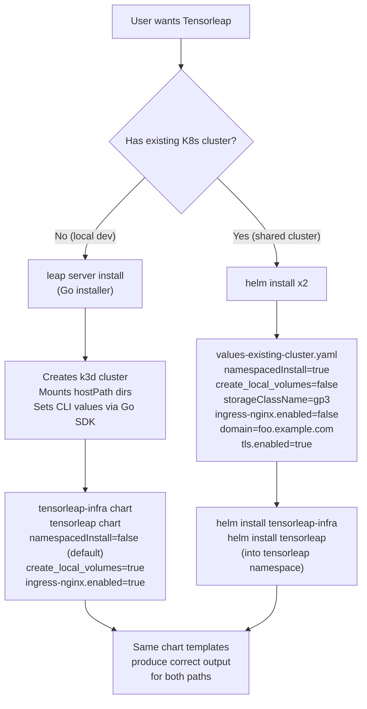

# Tensorleap Installation Modes

This document describes the two supported installation paths for Tensorleap:

1. **K3D mode (existing)** -- the Go installer creates a local k3d cluster and runs the Helm charts with hostPath persistent volumes. This is the default for local/standalone deployments.
2. **Existing Kubernetes cluster mode (new)** -- pure Helm install into an already-provisioned Kubernetes cluster (EKS, GKE, AKS, on-prem, etc.) using the cluster's own storage provisioner, ingress controller, and RBAC policies.

Both modes share the **same two Helm charts**:

- `charts/tensorleap-infra` -- ECK operator, Zot registry, NVIDIA device plugin (optional cluster-wide components)
- `charts/tensorleap` -- the main Tensorleap application (node-server, engine, web-ui, Keycloak, MongoDB, Elasticsearch, Minio, RabbitMQ)

---

## Background: What the Go Installer Does Today

The Go installer (`helm-charts` binary, commands `install`/`upgrade`/`uninstall`) orchestrates the complete k3d-based lifecycle:

1. Creates a k3d Docker cluster named `tensorleap` with port mappings, TLS forwarding, GPU support, registry mirrors, and host-path volume mounts
2. Installs `tensorleap-infra` and `tensorleap` Helm charts into the `tensorleap` namespace via the Helm v3 Go SDK
3. For air-gap installs, bootstraps a Zot registry and preloads container images
4. Manages persistent data under `/var/lib/tensorleap/standalone/storage/{elasticsearch,keycloak,mongodb,minio}` mounted from host into the k3d node
5. Computes Keycloak environment variables (`KC_HOSTNAME`, `KC_PROXY_HEADERS`, etc.) from TLS/domain/URL/proxy flags
6. Supports `--cert`/`--key` for TLS or runs on `http://localhost` by default
7. On uninstall: deletes the k3d cluster and optionally purges on-disk data

This path remains **the default and is unchanged** by this epic.

---

## New: Installation Into an Existing Kubernetes Cluster

The goal of this epic is to support a second installation path that lets users deploy Tensorleap into an existing Kubernetes cluster with:

1. **All resources consolidated under a single namespace** (typically `tensorleap`), with no cluster-wide RBAC side effects
2. **TLS + custom domain** OR **plain HTTP + localhost** (for port-forward testing)
3. **Persistent volumes via the cluster's own provisioner** (external storage class) instead of hostPath PVs
4. **Skip the bundled ingress-nginx** when the cluster already has a reverse proxy, while still rendering Tensorleap's own `Ingress` resources
5. **Standard Helm lifecycle** -- `helm install`, `helm upgrade`, `helm uninstall` -- for both charts, in order

No Go installer involvement. Pure `helm` CLI.

---

## Desired-State Matrix

| Capability | K3D Mode (default) | Existing K8s Mode |
|-----------|--------------------|--------------------|
| Cluster lifecycle | Go installer creates k3d | User provides cluster |
| Namespace | `tensorleap` (hardcoded in installer) | User-chosen, typically `tensorleap` |
| RBAC scope | Role (node-server) + `namespace: {{ .Release.Namespace }}` | Same, enforced via `global.namespacedInstall: true` |
| Persistent storage | hostPath PVs on node (`create_local_volumes: true`) | External PVCs via `storageClassName` |
| Ingress controller | Bundled ingress-nginx subchart | User's existing controller (disable subchart, keep our `Ingress` objects) |
| TLS | `--cert` / `--key` flags → `global.tls.*` | `global.tls.*` in values file, or `--set-file` |
| Keycloak proxy config | Computed by Go code from flags | Computed in Helm template from `global.*` values |
| Install command | `leap server install` | `helm install` (twice) |
| Upgrade command | `leap server upgrade` | `helm upgrade` (twice) |
| Uninstall command | `leap server uninstall` | `helm uninstall` (twice); PVCs retained by default |
| Air-gap support | Yes (Zot + containerd mirror) | Not supported in this mode (use OCI registries directly) |

---

## Implementation Summary

### 1. Consolidation of Resources Under a Single Namespace

#### The `global.namespacedInstall` flag

Added to [charts/tensorleap/values.yaml](../charts/tensorleap/values.yaml):

```yaml
global:
  # Set to true to install all resources strictly within the release namespace.
  # When true: node-server RBAC becomes Role (not ClusterRole), engine-cm and
  # node-server env get explicit namespace references, and no cluster-wide
  # resources are created. Use this for installing into existing shared
  # Kubernetes clusters. Default false preserves current k3d behavior.
  namespacedInstall: false
```

When set to `true`:

- **RBAC** -- [role.yaml](../charts/tensorleap/charts/node-server/templates/role.yaml) and [role-binding.yaml](../charts/tensorleap/charts/node-server/templates/role-binding.yaml) render as `Role` / `RoleBinding` only. The optional cross-namespace binding block is also skipped.
- **engine-cm** -- [engine-cm.yaml](../charts/tensorleap/charts/engine/templates/engine-cm.yaml) gets explicit `metadata.namespace: {{ .Release.Namespace }}`
- **node-server env** -- [node-server-env-configmap.yaml](../charts/tensorleap/charts/node-server/templates/node-server-env-configmap.yaml) gets `TARGET_NAMESPACE={{ .Release.Namespace }}`

When set to `false` (default): **byte-identical** to pre-epic behavior for k3d.

#### Universal namespace fixes (applied in both modes)

Replaced hardcoded `namespace: tensorleap` strings and `.tensorleap.svc.cluster.local` DNS references with `{{ .Release.Namespace }}`. These are safe because the default k3d release namespace *is* `tensorleap`, so they evaluate identically in the default path, but they stop breaking when installed into a differently-named namespace.

Files affected:

- [engine_sa.yaml](../charts/tensorleap/charts/engine/templates/engine_sa.yaml) -- 4 occurrences on ServiceAccount / Role / RoleBinding
- [engine-cm.yaml](../charts/tensorleap/charts/engine/templates/engine-cm.yaml) -- `REDIS_HOST`
- [node-server-env-configmap.yaml](../charts/tensorleap/charts/node-server/templates/node-server-env-configmap.yaml) -- `KEYCLOAK_CLUSTER_URL`

#### Verified behavior

Rendering in existing-k8s mode produces:

- **0** ClusterRoles / ClusterRoleBindings from our templates (verified via `helm template`)
- All non-namespace-scoped resources (PVs, if any) eliminated when `create_local_volumes=false`
- Every ConfigMap / Service / Ingress / RBAC object sits in `Release.Namespace`

### 2. TLS + Domain vs HTTP + Localhost

The chart supports all four combinations through existing values:

| Scenario | `global.domain` | `global.url` | `global.tls.enabled` | Keycloak result |
|----------|----------------|--------------|---------------------|-----------------|
| **HTTP + localhost** (default) | `localhost` | `http://localhost` | `false` | `KC_HOSTNAME_STRICT=false`, `KC_PROXY_HEADERS=forwarded`, `KC_HOSTNAME_STRICT_HTTPS=false` |
| **HTTPS + localhost** | `localhost` | `https://localhost` | `true` | Same as above plus `KC_HOSTNAME_STRICT_HTTPS=true`, `KC_HOSTNAME_ADMIN_URL` |
| **HTTP + real domain** | `foo.example.com` | `http://foo.example.com` | `false` | `KC_HOSTNAME_STRICT=true`, `KC_PROXY_HEADERS=xforwarded`, `KC_HOSTNAME=http://foo.example.com/auth` |
| **HTTPS + real domain** (production) | `foo.example.com` | `https://foo.example.com` | `true` | `KC_HOSTNAME_STRICT=true`, `KC_PROXY_HEADERS=xforwarded`, `KC_HOSTNAME=https://foo.example.com/auth`, `KC_HOSTNAME_STRICT_HTTPS=true`, `KC_HOSTNAME_ADMIN_URL=https://foo.example.com/auth` |

The Keycloak environment variables are computed directly in the Helm template (`extraEnv` block in [charts/tensorleap/values.yaml](../charts/tensorleap/values.yaml) lines 79-123) -- no Go code required. The Go installer still populates the same `global.*` values from its CLI flags, so both paths share the same template logic.

The TLS secret is rendered in [tls-secret.yaml](../charts/tensorleap/charts/node-server/templates/tls-secret.yaml) from `global.tls.cert` / `global.tls.key`. Ingress TLS termination is declared in [ingress.yaml](../charts/tensorleap/charts/node-server/templates/ingress.yaml).

### 3. Persistent Volumes via External Storage Class

The chart supports two storage modes controlled by existing values:

| Value | K3D default | Existing K8s |
|-------|-------------|--------------|
| `global.create_local_volumes` | `true` | `false` |
| `global.storageClassName` | `""` (unused) | e.g. `"gp3"`, `"standard"`, `"longhorn"` |

When `create_local_volumes: false` and `storageClassName` is set, all six persistent storage surfaces use the external storage class:

| Resource | File | Size |
|----------|------|------|
| MongoDB PVC | [mongodb-pvc.yaml](../charts/tensorleap/charts/node-server/templates/mongodb-pvc.yaml) | 8Gi |
| Elasticsearch PVC (pre-binding for ECK) | [elasticsearch-data-pvc.yaml](../charts/tensorleap/templates/elasticsearch-data-pvc.yaml) | 60Gi |
| Elasticsearch CR volumeClaimTemplates | [elasticsearch.yaml](../charts/tensorleap/templates/elasticsearch.yaml) | 60Gi |
| Keycloak PVC | [keycloak-data-pvc.yaml](../charts/tensorleap/templates/keycloak-data-pvc.yaml) | 8Gi |
| Minio PVC | [minio-pvc.yaml](../charts/tensorleap/templates/minio-pvc.yaml) | 2Gi |
| RabbitMQ StatefulSet volumeClaimTemplates | [rabbitmq-sts.yaml](../charts/tensorleap/templates/rabbitmq-sts.yaml) | 500Mi |

No static `PersistentVolume` objects are created in existing-k8s mode -- dynamic provisioning handles everything.

**Data retention:** Helm 3 does not delete PVCs on `helm uninstall`, so database data persists across reinstalls. Users who want a clean slate explicitly delete PVCs after uninstall.

### 4. Skipping ingress-nginx While Keeping Ingress Objects

The bundled ingress-nginx controller is a Helm **dependency** (subchart) gated by `ingress-nginx.enabled`. Setting it to `false` removes:

- `ingress-nginx-controller` Deployment
- `ingress-nginx-admission` Job + associated ClusterRole/ClusterRoleBinding
- `ingress-nginx` Service and webhook Service

But our own `Ingress` resources remain fully rendered (gated by the separate `ingress.enabled` which stays `true`):

- [ingress.yaml (node-server)](../charts/tensorleap/charts/node-server/templates/ingress.yaml) -- routes `/api`, `/auth/realms`, `/auth/resources`
- [ingress.yaml (web-ui)](../charts/tensorleap/charts/web-ui/templates/ingress.yaml) -- routes `/`
- [minio-ingress.yaml](../charts/tensorleap/templates/minio-ingress.yaml) -- routes `/session`

These use annotations like `kubernetes.io/ingress.class: nginx`, which the user's existing ingress controller picks up as long as it supports the `nginx` class (most do, via NGINX Ingress Controller, Contour, Traefik, or a Kubernetes `IngressClass`).

### 5. Install / Upgrade / Uninstall via Helm

#### Install (one-time)

```bash
# Step 1: Infra chart (optional if the cluster already has ECK operator)
helm install tensorleap-infra ./charts/tensorleap-infra \
  -n tensorleap --create-namespace \
  --set nvidiaGpu.enabled=false \
  --set registry.enabled=false

# Step 2: Main Tensorleap chart
helm install tensorleap ./charts/tensorleap \
  -n tensorleap \
  -f ./charts/tensorleap/examples/values-existing-cluster.yaml
```

See [values-existing-cluster.yaml](../charts/tensorleap/examples/values-existing-cluster.yaml) for a full example.

#### Upgrade

```bash
helm upgrade tensorleap ./charts/tensorleap \
  -n tensorleap -f values-existing-cluster.yaml
```

Helm handles rolling updates, revision history, and values diffing natively. For infra-chart upgrades (rare), the same pattern applies.

#### Uninstall

```bash
# Remove workloads (PVCs are retained)
helm uninstall tensorleap -n tensorleap
helm uninstall tensorleap-infra -n tensorleap

# Optional: wipe data
kubectl delete pvc -n tensorleap --all
kubectl delete namespace tensorleap
```

---

## Decision Tree



---

## Guarantees

### For K3D Installs (Regression Safety)

- `global.namespacedInstall` defaults to `false` -- zero behavior change
- All new template conditionals fall through to the original rendering when the flag is unset
- `helm template` output for the default k3d values is byte-identical (modulo the universal namespace-fix substitutions, which evaluate to the same `tensorleap` string)
- `go test ./pkg/helm/...` passes

### For Existing-K8s Installs

- When `namespacedInstall=true` and `ingress-nginx.enabled=false` and `datadog.enabled=false`:
  - **Zero** ClusterRoles / ClusterRoleBindings produced by our templates
  - **Zero** `PersistentVolume` objects produced (PVCs only)
  - All resources land in the release namespace
- `helm uninstall` cleanly removes everything except PVCs (by design, to preserve data)
- Supports all four TLS/domain combinations

---

## File Reference

### Modified chart files

| File | Purpose |
|------|---------|
| [charts/tensorleap/values.yaml](../charts/tensorleap/values.yaml) | Added `global.namespacedInstall: false` |
| [charts/tensorleap/charts/engine/templates/engine_sa.yaml](../charts/tensorleap/charts/engine/templates/engine_sa.yaml) | Namespace references: `tensorleap` → `{{ .Release.Namespace }}` |
| [charts/tensorleap/charts/engine/templates/engine-cm.yaml](../charts/tensorleap/charts/engine/templates/engine-cm.yaml) | Redis DNS + conditional namespace on metadata |
| [charts/tensorleap/charts/node-server/templates/node-server-env-configmap.yaml](../charts/tensorleap/charts/node-server/templates/node-server-env-configmap.yaml) | Keycloak DNS + conditional `TARGET_NAMESPACE` |
| [charts/tensorleap/charts/node-server/templates/role.yaml](../charts/tensorleap/charts/node-server/templates/role.yaml) | Honor `namespacedInstall` in Role/ClusterRole conditional |
| [charts/tensorleap/charts/node-server/templates/role-binding.yaml](../charts/tensorleap/charts/node-server/templates/role-binding.yaml) | Same, plus guard cross-namespace binding |
| [charts/tensorleap/templates/elasticsearch.yaml](../charts/tensorleap/templates/elasticsearch.yaml) | Added `storageClassName` to `volumeClaimTemplates` |

### New files

| File | Purpose |
|------|---------|
| [charts/tensorleap/examples/values-existing-cluster.yaml](../charts/tensorleap/examples/values-existing-cluster.yaml) | Example values file for existing-cluster installs |
| [docs/INSTALL-MODES.md](INSTALL-MODES.md) | This document |

---

## Not Yet In Scope

The following are explicitly **not addressed** in this epic and remain Go-installer-only features:

- Air-gap installation (image preloading into Zot, containerd mirror configuration)
- GPU support via NVIDIA device plugin in `kube-system` (users of existing clusters handle GPU enablement themselves)
- Automatic reinstall detection on chart version skew or failed Helm releases
- Host data directory management (`/var/lib/tensorleap/standalone/...`)
- Random hostname generation

Users of existing Kubernetes clusters manage these concerns through their cluster tooling (container registry, node device plugins, storage class provisioning) rather than the Tensorleap installer.
