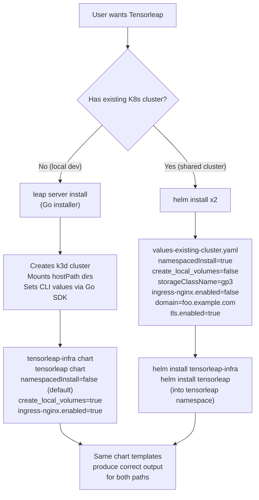

# Tensorleap Installation Modes

This document describes the two supported installation paths for Tensorleap:

1. **K3D mode (existing)** -- the Go installer creates a local k3d cluster and runs the Helm charts with hostPath persistent volumes. This is the default for local/standalone deployments.
2. **Existing Kubernetes cluster mode (new)** -- pure Helm install into an already-provisioned Kubernetes cluster (EKS, GKE, AKS, on-prem, etc.) using the cluster's own storage provisioner, ingress controller, and RBAC policies.

Both modes share the **same two Helm charts**:

- `charts/tensorleap-infra` -- ECK operator, Zot registry, NVIDIA device plugin (optional cluster-wide components)
- `charts/tensorleap` -- the main Tensorleap application (node-server, engine, web-ui, Keycloak, MongoDB, Elasticsearch, Minio, RabbitMQ)

---

## Background: What the Go Installer Does Today

The Go installer (`helm-charts` binary, commands `install`/`upgrade`/`uninstall`) orchestrates the complete k3d-based lifecycle:

1. Creates a k3d Docker cluster named `tensorleap` with port mappings, TLS forwarding, GPU support, registry mirrors, and host-path volume mounts
2. Installs `tensorleap-infra` and `tensorleap` Helm charts into the `tensorleap` namespace via the Helm v3 Go SDK
3. For air-gap installs, bootstraps a Zot registry and preloads container images
4. Manages persistent data under `/var/lib/tensorleap/standalone/storage/{elasticsearch,keycloak,mongodb,minio}` mounted from host into the k3d node
5. Computes Keycloak environment variables (`KC_HOSTNAME`, `KC_PROXY_HEADERS`, etc.) from TLS/domain/URL/proxy flags
6. Supports `--cert`/`--key` for TLS or runs on `http://localhost` by default
7. On uninstall: deletes the k3d cluster and optionally purges on-disk data

This path remains **the default and is unchanged** by this epic.

---

## New: Installation Into an Existing Kubernetes Cluster

The goal of this epic is to support a second installation path that lets users deploy Tensorleap into an existing Kubernetes cluster with:

1. **All resources consolidated under a single namespace** (typically `tensorleap`), with no cluster-wide RBAC side effects
2. **TLS + custom domain** OR **plain HTTP + localhost** (for port-forward testing)
3. **Persistent volumes via the cluster's own provisioner** (external storage class) instead of hostPath PVs
4. **Skip the bundled ingress-nginx** when the cluster already has a reverse proxy, while still rendering Tensorleap's own `Ingress` resources
5. **Standard Helm lifecycle** -- `helm install`, `helm upgrade`, `helm uninstall` -- for both charts, in order

No Go installer involvement. Pure `helm` CLI.

---

## Desired-State Matrix

| Capability | K3D Mode (default) | Existing K8s Mode |
|-----------|--------------------|--------------------|
| Cluster lifecycle | Go installer creates k3d | User provides cluster |
| Namespace | `tensorleap` (hardcoded in installer) | User-chosen, typically `tensorleap` |
| RBAC scope | Role (node-server) + `namespace: {{ .Release.Namespace }}` | Same, enforced via `global.namespacedInstall: true` |
| Persistent storage | hostPath PVs on node (`create_local_volumes: true`) | External PVCs via `storageClassName` |
| Ingress controller | Bundled ingress-nginx subchart | User's existing controller (disable subchart, keep our `Ingress` objects) |
| TLS | `--cert` / `--key` flags → `global.tls.*` | `global.tls.*` in values file, or `--set-file` |
| Keycloak proxy config | Computed by Go code from flags | Computed in Helm template from `global.*` values |
| Install command | `leap server install` | `helm install` (twice) |
| Upgrade command | `leap server upgrade` | `helm upgrade` (twice) |
| Uninstall command | `leap server uninstall` | `helm uninstall` (twice); only controller-managed PVCs (RabbitMQ STS, ECK ES) survive -- see [Uninstall and data retention](#uninstall-and-data-retention) |
| Air-gap support | Yes (Zot + containerd mirror) | Not supported in this mode (use OCI registries directly) |

---

## Implementation Summary

### 1. Consolidation of Resources Under a Single Namespace

#### The `global.namespacedInstall` flag

Added to [charts/tensorleap/values.yaml](../charts/tensorleap/values.yaml):

```yaml
global:
  # Set to true to install all resources strictly within the release namespace.
  # When true: node-server RBAC becomes Role (not ClusterRole), engine-cm and
  # node-server env get explicit namespace references, and no cluster-wide
  # resources are created. Use this for installing into existing shared
  # Kubernetes clusters. Default false preserves current k3d behavior.
  namespacedInstall: false
```

When set to `true`:

- **RBAC** -- [role.yaml](../charts/tensorleap/charts/node-server/templates/role.yaml) and [role-binding.yaml](../charts/tensorleap/charts/node-server/templates/role-binding.yaml) render as `Role` / `RoleBinding` only. The optional cross-namespace binding block is also skipped.
- **engine-cm** -- [engine-cm.yaml](../charts/tensorleap/charts/engine/templates/engine-cm.yaml) gets explicit `metadata.namespace: {{ .Release.Namespace }}`
- **node-server env** -- [node-server-env-configmap.yaml](../charts/tensorleap/charts/node-server/templates/node-server-env-configmap.yaml) gets `TARGET_NAMESPACE={{ .Release.Namespace }}`

When set to `false` (default): **byte-identical** to pre-epic behavior for k3d.

#### Universal namespace fixes (applied in both modes)

Replaced hardcoded `namespace: tensorleap` strings and `.tensorleap.svc.cluster.local` DNS references with `{{ .Release.Namespace }}`. These are safe because the default k3d release namespace *is* `tensorleap`, so they evaluate identically in the default path, but they stop breaking when installed into a differently-named namespace.

Files affected:

- [engine_sa.yaml](../charts/tensorleap/charts/engine/templates/engine_sa.yaml) -- 4 occurrences on ServiceAccount / Role / RoleBinding
- [engine-cm.yaml](../charts/tensorleap/charts/engine/templates/engine-cm.yaml) -- `REDIS_HOST`
- [node-server-env-configmap.yaml](../charts/tensorleap/charts/node-server/templates/node-server-env-configmap.yaml) -- `KEYCLOAK_CLUSTER_URL`

#### Verified behavior

Rendering in existing-k8s mode produces:

- **0** ClusterRoles / ClusterRoleBindings from our templates (verified via `helm template`)
- All non-namespace-scoped resources (PVs, if any) eliminated when `create_local_volumes=false`
- Every ConfigMap / Service / Ingress / RBAC object sits in `Release.Namespace`

### 2. TLS + Domain vs HTTP + Localhost

The chart supports three combinations. The fourth (HTTP on a non-loopback domain) is **rejected at install time** because Keycloak's `sslRequired: external` realm policy refuses plaintext authentication on non-loopback hosts -- the user would otherwise see an "HTTPS required" page on first browser login.

| Scenario | `global.domain` | `global.url` | `global.tls.enabled` | Result |
|----------|----------------|--------------|---------------------|--------|
| **HTTP + localhost** (default for k3d) | `localhost` / `127.0.0.1` / `::1` | `http://localhost` | `false` | OK -- Keycloak whitelists loopback |
| **HTTPS + localhost** | `localhost` | `https://localhost` | `true` | OK |
| **HTTPS + real domain** (production) | `foo.example.com` | `https://foo.example.com` | `true` | OK |
| **HTTP + real domain** | `foo.example.com` | `http://foo.example.com` | `false` | Install succeeds, but Keycloak rejects browser login with "HTTPS required". The chart prints a `NOTES` warning, and `leap server install` logs a stderr warning on the same combination. |

Keycloak environment variables (`KC_HOSTNAME`, `KC_HOSTNAME_STRICT`, `KC_PROXY_HEADERS`, `KC_HOSTNAME_STRICT_HTTPS`, `KC_HOSTNAME_ADMIN_URL`) are computed directly in the Helm template (`extraEnv` block in [charts/tensorleap/values.yaml](../charts/tensorleap/values.yaml)) from these three values -- no Go code required. The Go installer populates the same `global.*` values from its CLI flags.

The TLS secret is rendered in [tls-secret.yaml](../charts/tensorleap/charts/node-server/templates/tls-secret.yaml) from `global.tls.cert` / `global.tls.key`. Ingress TLS termination is declared in [ingress.yaml](../charts/tensorleap/charts/node-server/templates/ingress.yaml).

### 3. Persistent Volumes via External Storage Class

The chart supports two storage modes controlled by existing values:

| Value | K3D default | Existing K8s |
|-------|-------------|--------------|
| `global.create_local_volumes` | `true` | `false` |
| `global.storageClassName` | `""` (unused) | e.g. `"gp3"`, `"standard"`, `"longhorn"` |

When `create_local_volumes: false` and `storageClassName` is set, all six persistent storage surfaces use the external storage class:

| Resource | File | Size |
|----------|------|------|
| MongoDB PVC | [mongodb-pvc.yaml](../charts/tensorleap/charts/node-server/templates/mongodb-pvc.yaml) | 8Gi |
| Elasticsearch PVC (pre-binding for ECK) | [elasticsearch-data-pvc.yaml](../charts/tensorleap/templates/elasticsearch-data-pvc.yaml) | 60Gi |
| Elasticsearch CR volumeClaimTemplates | [elasticsearch.yaml](../charts/tensorleap/templates/elasticsearch.yaml) | 60Gi |
| Keycloak PVC | [keycloak-data-pvc.yaml](../charts/tensorleap/templates/keycloak-data-pvc.yaml) | 8Gi |
| Minio PVC | [minio-pvc.yaml](../charts/tensorleap/templates/minio-pvc.yaml) | 2Gi |
| RabbitMQ StatefulSet volumeClaimTemplates | [rabbitmq-sts.yaml](../charts/tensorleap/templates/rabbitmq-sts.yaml) | 500Mi |

No static `PersistentVolume` objects are created in existing-k8s mode -- dynamic provisioning handles everything.

**Data retention (important caveat):** On `helm uninstall`, only PVCs managed by controllers are retained automatically:

- `rabbitmq-data-rabbitmq-0` -- `StatefulSet.volumeClaimTemplates`; kept by the StatefulSet controller.
- `elasticsearch-data-tl-elasticsearch-es-master-0` -- initially pre-bound by our template, subsequently owned by the `Elasticsearch` CR's `volumeClaimTemplates`; ECK retains it on CR update but deletes it when the CR itself is removed.

Helm-managed PVCs (`mongodb-data`, `keycloak-data`, `tensorleap-minio`) do **not** carry `helm.sh/resource-policy: keep`, so Helm 3 deletes them on `helm uninstall`. If data retention across full uninstall/reinstall is required for these components, either add the annotation in the chart templates or take an external backup before `helm uninstall`.

### 4. Skipping ingress-nginx While Keeping Ingress Objects

The bundled ingress-nginx controller is a Helm **dependency** (subchart) gated by `ingress-nginx.enabled`. Setting it to `false` removes:

- `ingress-nginx-controller` Deployment
- `ingress-nginx-admission` Job + associated ClusterRole/ClusterRoleBinding
- `ingress-nginx` Service and webhook Service

But our own `Ingress` resources remain fully rendered (gated by the separate `ingress.enabled` which stays `true`):

- [ingress.yaml (node-server)](../charts/tensorleap/charts/node-server/templates/ingress.yaml) -- routes `/api`, `/auth/realms`, `/auth/resources`
- [ingress.yaml (web-ui)](../charts/tensorleap/charts/web-ui/templates/ingress.yaml) -- routes `/`
- [minio-ingress.yaml](../charts/tensorleap/templates/minio-ingress.yaml) -- routes `/session`

These use annotations like `kubernetes.io/ingress.class: nginx`, which the user's existing ingress controller picks up as long as it supports the `nginx` class (most do, via NGINX Ingress Controller, Contour, Traefik, or a Kubernetes `IngressClass`).

### 5. Install / Upgrade / Uninstall via Helm

The full production walkthrough lives in [Production Install Walkthrough](#production-install-walkthrough-existing-kubernetes-cluster) below. The summary (assumes one-time `helm repo add tensorleap https://helm.tensorleap.ai && helm repo update`):

| Step | Command |
|---|---|
| Install infra | `helm upgrade --install tensorleap-infra tensorleap/tensorleap-infra -n tensorleap --create-namespace --set nvidiaGpu.enabled=false --set registry.enabled=false` |
| Install app | `helm upgrade --install tensorleap tensorleap/tensorleap -n tensorleap -f my-values.yaml --set-file global.tls.cert=tls.crt --set-file global.tls.key=tls.key` |
| Upgrade | `helm repo update && helm upgrade tensorleap tensorleap/tensorleap -n tensorleap -f my-values.yaml --set-file global.tls.cert=tls.crt --set-file global.tls.key=tls.key` |
| Uninstall | `helm uninstall tensorleap -n tensorleap && helm uninstall tensorleap-infra -n tensorleap` (see retention caveat) |

Each command resolves to the **latest** chart version in the repo. Pin a specific release by appending `--version <semver>` to the install/upgrade commands (the infra chart is rarely pinned -- it uses its own slow-moving version stream).

Helm handles rolling updates, revision history, and values diffing natively.

---

## Production Install Walkthrough (Existing Kubernetes Cluster)

This section covers the full lifecycle for a real customer install. Two artefacts mirror it:

- [`scripts/install-existing-cluster.sh`](../scripts/install-existing-cluster.sh) -- an operator-style runbook script that performs the steps below. It works two ways:
   - **From a local clone** (developer / on-prem packaging): `cd helm-charts && scripts/install-existing-cluster.sh ...` -- charts are read from the `charts/` directory next to the script.
   - **From a customer workstation that has only the script** (and no clone): the script `helm repo add`s the public Helm repo at `https://helm.tensorleap.ai` automatically and installs from there. Use `--source remote --version <semver>` to pin a specific chart release; omit `--version` for latest.
   - Auto-detection chooses local if the `charts/` directory exists next to the script, otherwise remote. Override with `--source local|remote`.
   - Run `scripts/install-existing-cluster.sh --help` for the flag list, or `make install-existing-cluster ARGS="..."`.
- [`scripts/test-existing-cluster.sh`](../scripts/test-existing-cluster.sh) -- the end-to-end *test* (Kind cluster, self-signed cert, six A1-A6 assertions, uninstall + retention check, chart-guard check). Use this to validate chart changes locally; do **not** run it against a customer cluster.

### Prerequisites the customer owns

| Concern | Required | Notes |
|---|---|---|
| Kubernetes cluster | 1.27+ with `kubectl` access | EKS / GKE / AKS / on-prem all fine |
| StorageClass | One present in the cluster, e.g. `gp3` (EKS), `pd-ssd` (GKE), `managed-csi` (AKS), `longhorn`, ... | For production set `reclaimPolicy: Retain` so disks survive PVC deletion |
| Ingress controller | An ingress controller already running (NGINX / Contour / Traefik) handling the `nginx` IngressClass | The chart's bundled ingress-nginx subchart is disabled in this mode |
| DNS | A record pointing `tensorleap.example.com` at the ingress controller's load balancer | Required -- non-loopback domains are mandatory unless you accept the loopback override |
| TLS certificate | Real cert + key for the domain | Let's Encrypt via cert-manager, paid CA, or internal PKI. Self-signed works but the browser warning is annoying for users |
| GPU (optional) | NVIDIA device plugin pre-installed in the cluster | Tensorleap does not install it for you in this mode |

### Step 1 -- prepare a values file

Start from [`charts/tensorleap/examples/values-existing-cluster.yaml`](../charts/tensorleap/examples/values-existing-cluster.yaml) and override only what differs for your environment:

```yaml
global:
  namespacedInstall: true              # no cluster-scoped RBAC
  create_local_volumes: false          # use the cluster's StorageClass
  storageClassName: "gp3"              # ← your StorageClass

  domain: "tensorleap.example.com"     # ← your DNS name
  url:    "https://tensorleap.example.com"

  tls:
    enabled: true                      # mandatory for non-loopback domains
    # cert and key are injected from PEM files via --set-file (Step 3)

  elasticsearch: { enabled: true, url: "" }
  keycloakx:     { enabled: true }

ingress-nginx: { enabled: false }      # use the cluster's existing controller
datadog:       { enabled: false }
```

If `global.tls.enabled` is left `false` while `global.domain` is non-loopback, the chart still installs but emits a `NOTES` warning -- Keycloak will refuse browser logins until TLS is added. The Go installer logs the same warning on stderr.

### Step 2 -- add the Helm repo

> The helm commands in steps 2-4 are exactly what `scripts/install-existing-cluster.sh` runs after its preflight checks. You can either run that script directly (recommended for first-time installs because it sanity-checks StorageClass, IngressClass, and TLS material before touching the cluster) or run the helm commands manually.

```bash
helm repo add tensorleap https://helm.tensorleap.ai
helm repo update
```

If you have a clone of this repo and want to install from it instead, skip this step and use the local path (`./charts/tensorleap-infra`, `./charts/tensorleap`) wherever the commands below reference `tensorleap/tensorleap-infra` / `tensorleap/tensorleap`.

### Step 3 -- install the infra chart

The infra chart provides the ECK CRDs (used by the main chart's `Elasticsearch` resource) and the optional Zot registry / NVIDIA device plugin. Install it before the main chart:

```bash
helm upgrade --install tensorleap-infra tensorleap/tensorleap-infra \
  -n tensorleap --create-namespace \
  --set nvidiaGpu.enabled=false \
  --set registry.enabled=false
```

Skip subcharts you already provide (e.g. if ECK is already installed cluster-wide, set `eck-operator.enabled=false`).

### Step 4 -- install the main chart

Inject the cert and key from PEM files instead of inlining them in the values file (keeps them out of git and out of `helm get values`):

```bash
helm upgrade --install tensorleap tensorleap/tensorleap \
  -n tensorleap \
  -f my-values.yaml \
  --set-file global.tls.cert=./tls.crt \
  --set-file global.tls.key=./tls.key \
  --timeout 15m
```

This grabs the **latest** chart version published to the repo. To pin a specific release for reproducibility, append `--version <semver>` (e.g. `--version 1.5.97`).

`--timeout 15m` gives Elasticsearch + ECK enough time on slower CSI provisioners.

### Step 5 -- verify the install

The same six checks the test script runs (A1-A6 in [Local End-to-End Test](#local-end-to-end-test)):

```bash
# Pods Ready
kubectl get pods -n tensorleap

# Every PVC Bound on your StorageClass
kubectl get pvc -n tensorleap

# Zero cluster-scoped RBAC owned by the release
kubectl get clusterrole,clusterrolebinding \
  -l app.kubernetes.io/instance=tensorleap

# Keycloak realm reachable over HTTPS
curl -s https://tensorleap.example.com/auth/realms/tensorleap | jq .realm
# → "tensorleap"

# OIDC discovery
curl -s https://tensorleap.example.com/auth/realms/tensorleap/.well-known/openid-configuration | jq .issuer
```

### Upgrade

```bash
helm repo update
helm upgrade tensorleap tensorleap/tensorleap \
  -n tensorleap \
  -f my-values.yaml \
  --set-file global.tls.cert=./tls.crt \
  --set-file global.tls.key=./tls.key
```

Without `--version`, this rolls forward to whatever version is currently the latest in the repo. Pin with `--version <semver>` for reproducible upgrades. `helm history tensorleap -n tensorleap` shows what was deployed, and `helm rollback tensorleap <rev>` reverts. Bump the chart version in `Chart.yaml` for any chart-affecting change so the release reflects what was deployed.

There is no equivalent of the Go installer's "previous params" rescue here -- the customer is expected to keep `my-values.yaml` and the cert/key around between runs, the same way any other Helm-deployed app is operated.

### Uninstall and data retention

```bash
helm uninstall tensorleap       -n tensorleap
helm uninstall tensorleap-infra -n tensorleap
```

What survives `helm uninstall` is **not uniform** across components:

| PVC | Survives uninstall? | Why |
|---|---|---|
| `rabbitmq-data-rabbitmq-0` | yes | Owned by `StatefulSet.volumeClaimTemplates` (StatefulSet controller, not Helm) |
| `elasticsearch-data-tl-elasticsearch-es-master-0` | yes (during chart upgrade); no when `helm uninstall` removes the `Elasticsearch` CR itself | ECK manages it via `volumeClaimTemplates` after init |
| `mongodb-data` | **no** | Helm-owned, no `resource-policy: keep` annotation today |
| `keycloak-data` | **no** | same |
| `tensorleap-minio` | **no** | same |

For full retention across `helm uninstall` you have three options today:

1. **Back up before uninstall** -- Velero namespace backup, or app-level dumps (`mongodump`, ES snapshots).
2. **Patch annotations before uninstall** -- `kubectl annotate pvc -n tensorleap mongodb-data keycloak-data tensorleap-minio helm.sh/resource-policy=keep`. Brittle but works for one-off operations.
3. **Add the annotation in the chart templates** (preferred long-term) -- ideally values-gated (e.g. `global.retainPvcsOnUninstall: true`) so k3d behavior is unchanged. This is a chart change, not solvable customer-side.

For data to survive **cluster destruction** (not just `helm uninstall`), you also need a StorageClass with `reclaimPolicy: Retain` on top of a storage backend that lives outside the cluster (EBS / GCE PD / Azure Disk / NetApp / Longhorn). With `Retain`, deleting a PVC marks the PV as `Released` instead of garbage-collecting the disk. After cluster destruction the disks are still in your cloud account; recovering them requires re-creating PVs that point at the existing volume IDs (Velero automates this).

### Common gotchas

- **"HTTPS required" page on first login.** Means you installed with a non-loopback `global.domain` but `global.tls.enabled=false`. The chart's NOTES output and the Go installer log warn about this, but the install itself is allowed. Re-run `helm upgrade ... --reuse-values --set global.tls.enabled=true --set-file global.tls.cert=... --set-file global.tls.key=...` to fix.
- **`Ingress` not picked up by your controller.** The chart annotates ingresses with `kubernetes.io/ingress.class: nginx`. If your controller uses a different IngressClass, override the annotation.
- **Elasticsearch stuck Pending after upgrade.** Usually a StorageClass with `volumeBindingMode: Immediate` racing the pod scheduler. Switch the class to `WaitForFirstConsumer`.
- **Wrong namespace for ingress-nginx default-ssl-certificate.** If you keep ingress-nginx enabled but install into a non-`tensorleap` namespace, set `ingress-nginx.controller.extraArgs.default-ssl-certificate=<your-ns>/tls-secret`.

---

## Local End-to-End Test

A self-contained test that spins up a Kind cluster, installs an **external** `ingress-nginx` (not the bundled subchart), installs both Helm charts, and runs assertions that map 1:1 onto the guarantees below.

```bash
make test-existing-cluster         # idempotent; reuses the Kind cluster
make test-existing-cluster-clean   # tears the cluster down
```

The script lives at [scripts/test-existing-cluster.sh](../scripts/test-existing-cluster.sh) and uses [test/kind-config.yaml](../test/kind-config.yaml) and [charts/tensorleap/examples/values-kind-test.yaml](../charts/tensorleap/examples/values-kind-test.yaml). It mirrors a production install (HTTPS on a non-loopback domain `tensorleap.local` with a self-signed cert generated locally, never committed to the repo) and runs nine phases:

0. **TLS material** -- generate (or reuse) a self-signed cert at `test/tls.crt` / `test/tls.key`. The `.gitignore` keeps these out of the repo.
1. **Pre-render** -- `helm template` and check that no cluster-scoped RBAC is emitted from our own templates.
2. **Cluster up** -- create (or reuse) a Kind cluster named `tensorleap-test`; wait for the node Ready and confirm the default `standard` StorageClass.
3. **External ingress** -- apply `kubernetes/ingress-nginx` Kind manifest and wait for the controller Ready. This proves the chart's `Ingress` objects work with a user-supplied controller.
4. **Install** -- `helm install tensorleap-infra`, then `helm install tensorleap -f values-kind-test.yaml --set-file global.tls.cert=... --set-file global.tls.key=...`; wait for all pods Ready.
5. **Assertions** (six):
   - A1: zero `ClusterRole`/`ClusterRoleBinding` owned by the release.
   - A2: every PVC `Bound` on the configured StorageClass.
   - A3: every PV was dynamically provisioned (has `pv.kubernetes.io/provisioned-by` annotation).
   - A4: Keycloak env contains `KC_HOSTNAME=https://tensorleap.local/auth`, `KC_HOSTNAME_STRICT=true`, `KC_HOSTNAME_STRICT_HTTPS=true`, `KC_HOSTNAME_ADMIN_URL=https://tensorleap.local/auth`.
   - A5: HTTPS GET on `https://tensorleap.local/auth/realms/tensorleap` returns 200.
   - A6: HTTPS GET on the OIDC login URL (`/auth/realms/tensorleap/protocol/openid-connect/auth?...`) returns 200 -- regression guard for the secure-by-default contract; this is the URL that previously triggered the "HTTPS required" page when running over HTTP.
6. **Upgrade smoke** -- `helm upgrade` with a small value change and wait for rollouts; catches immutable-field mutations.
7. **Uninstall + retention** -- `helm uninstall`, then assert `rabbitmq-data-rabbitmq-0` survives and Helm-managed PVCs are deleted (matches the "Data retention" caveat above).
8. **Guard** -- `helm template` with `domain=tensorleap.local + tls.enabled=false` MUST fail; verifies the chart-level pre-render validation.

Runtime: ~5 minutes on a warm cluster, ~8-10 minutes cold (image pulls dominate).

Browser access (after `make test-existing-cluster` finishes):

```bash
echo "127.0.0.1 tensorleap.local" | sudo tee -a /etc/hosts
open https://tensorleap.local/   # accept the self-signed cert warning once
```

Required tools: `kind`, `kubectl`, `helm`, `jq`, `curl`, `docker`, `openssl`.

---

## Decision Tree



---

## Guarantees

### For K3D Installs (Regression Safety)

- `global.namespacedInstall` defaults to `false` -- zero behavior change
- All new template conditionals fall through to the original rendering when the flag is unset
- `helm template` output for the default k3d values is byte-identical (modulo the universal namespace-fix substitutions, which evaluate to the same `tensorleap` string)
- `go test ./pkg/helm/...` passes

### For Existing-K8s Installs

- When `namespacedInstall=true` and `ingress-nginx.enabled=false` and `datadog.enabled=false`:
  - **Zero** ClusterRoles / ClusterRoleBindings produced by our templates
  - **Zero** `PersistentVolume` objects produced (PVCs only)
  - All resources land in the release namespace
- `helm uninstall` cleanly removes all workloads. Controller-owned PVCs (RabbitMQ STS, ECK Elasticsearch during upgrade) survive; Helm-owned PVCs (`mongodb-data`, `keycloak-data`, `tensorleap-minio`) are deleted unless the templates carry `helm.sh/resource-policy: keep` -- see [Uninstall and data retention](#uninstall-and-data-retention).
- Supports the three valid TLS/domain combinations. The broken combination (HTTP + non-loopback) is allowed but produces a `NOTES` warning from the chart and a stderr warning from the Go installer.

---

## File Reference

### Modified chart files

| File | Purpose |
|------|---------|
| [charts/tensorleap/values.yaml](../charts/tensorleap/values.yaml) | Added `global.namespacedInstall: false` |
| [charts/tensorleap/charts/engine/templates/engine_sa.yaml](../charts/tensorleap/charts/engine/templates/engine_sa.yaml) | Namespace references: `tensorleap` → `{{ .Release.Namespace }}` |
| [charts/tensorleap/charts/engine/templates/engine-cm.yaml](../charts/tensorleap/charts/engine/templates/engine-cm.yaml) | Redis DNS + conditional namespace on metadata |
| [charts/tensorleap/charts/node-server/templates/node-server-env-configmap.yaml](../charts/tensorleap/charts/node-server/templates/node-server-env-configmap.yaml) | Keycloak DNS + conditional `TARGET_NAMESPACE` |
| [charts/tensorleap/charts/node-server/templates/role.yaml](../charts/tensorleap/charts/node-server/templates/role.yaml) | Honor `namespacedInstall` in Role/ClusterRole conditional |
| [charts/tensorleap/charts/node-server/templates/role-binding.yaml](../charts/tensorleap/charts/node-server/templates/role-binding.yaml) | Same, plus guard cross-namespace binding |
| [charts/tensorleap/templates/elasticsearch.yaml](../charts/tensorleap/templates/elasticsearch.yaml) | Added `storageClassName` to `volumeClaimTemplates` |

### New files

| File | Purpose |
|------|---------|
| [charts/tensorleap/templates/NOTES.txt](../charts/tensorleap/templates/NOTES.txt) | Post-install notes; warns when a non-loopback domain is paired with `tls.enabled=false` |
| [charts/tensorleap/examples/values-existing-cluster.yaml](../charts/tensorleap/examples/values-existing-cluster.yaml) | Example values file for existing-cluster installs (header includes both script and plain-helm quick-start commands) |
| [charts/tensorleap/examples/values-kind-test.yaml](../charts/tensorleap/examples/values-kind-test.yaml) | Values used by the local Kind end-to-end test |
| [scripts/install-existing-cluster.sh](../scripts/install-existing-cluster.sh) | Operator-style installer for a customer's existing K8s cluster (preflight + helm upgrade --install + readiness wait) |
| [scripts/test-existing-cluster.sh](../scripts/test-existing-cluster.sh) | End-to-end test against a Kind cluster (HTTPS, self-signed cert) |
| [test/kind-config.yaml](../test/kind-config.yaml) | Kind cluster definition with host port mappings for 80/443 |
| [docs/INSTALL-MODES.md](INSTALL-MODES.md) | This document |

---

## Not Yet In Scope

The following are explicitly **not addressed** in this epic and remain Go-installer-only features:

- Air-gap installation (image preloading into Zot, containerd mirror configuration)
- GPU support via NVIDIA device plugin in `kube-system` (users of existing clusters handle GPU enablement themselves)
- Automatic reinstall detection on chart version skew or failed Helm releases
- Host data directory management (`/var/lib/tensorleap/standalone/...`)
- Random hostname generation

Users of existing Kubernetes clusters manage these concerns through their cluster tooling (container registry, node device plugins, storage class provisioning) rather than the Tensorleap installer.
